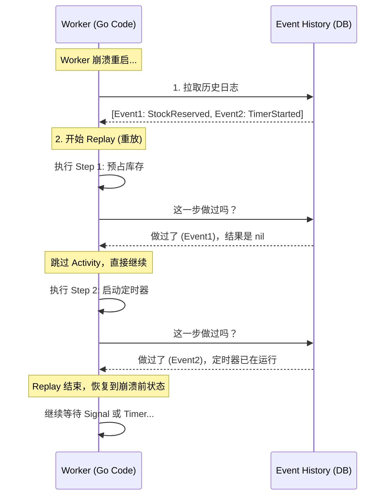

# OmniFlow v2.5: 生产级分布式电商履约系统


**OmniFlow** 是一个基于 **Temporal** 和 **Go** 构建的、具备高可靠性的分布式订单履约引擎。
本项目演示了如何在微服务架构下，通过 **Saga 模式** 解决分布式事务问题，利用 **MySQL 悲观锁** 解决高并发库存扣减问题，并基于 **Event Sourcing** 机制实现了长运行流程的持久化与容错。

## 🚀 核心特性 (Key Features)

* **💎 双数据库架构**: **Temporal (PostgreSQL)** 负责流程状态持久化，**业务层 (MySQL)** 负责资产数据存储，彻底解耦。
* **🛡️ 强一致性幂等 (Idempotency Framework)**: 自研基于 MySQL 唯一键 + 事务原子性的 `dedup` 中间件，完美解决分布式重试导致的“资产重复扣减”问题。
* **🔒 高并发防超卖**: 在 Activity 中集成 `SELECT ... FOR UPDATE` 悲观锁，确保在高并发秒杀场景下的库存数据准确性。
* **🔄 分布式事务 (Saga Pattern)**: 支付失败或风控拒绝时，自动触发补偿流程（Compensations），回滚已扣减的库存。
* **🧩 复杂流程编排**:
    * **Child Workflows**: 实现拆单逻辑，并行处理多仓库发货（Fan-out/Fan-in）。
    * **Human-in-the-Loop**: 大额订单自动挂起，等待人工通过 API 审核。
    * **Durable Timers**: 基于持久化定时器的订单超时自动取消机制。

## 🏗️ 系统架构 (Architecture)

```text
OmniFlow/
├── cmd/
│   ├── api-server/      # [入口] Gin HTTP 网关 (Port 8000)
│   └── worker/          # [入口] Temporal Worker (含 DB 初始化与自动迁移)
├── internal/
│   ├── app/             # [业务层]
│   │   ├── activities.go      # 包含 GORM 事务、锁机制的业务动作
│   │   ├── workflow.go        # 主流程编排 (Saga, Signal, Timer)
│   │   └── workflow_child.go  # 子流程 (并行发货)
│   ├── common/          # [模型层] 通用结构体
│   └── pkg/
│       └── dedup/       # [核心组件] 幂等性执行器中间件
├── docker-compose.yml   # 基础设施 (MySQL 8 + Temporal + PostgreSQL)
└── go.mod

```

## 📖 核心原理解析 (Under the Hood)

OmniFlow 之所以能处理长达数天的订单流程且不怕宕机，归功于 Temporal 的 **Event Sourcing (事件溯源)** 和 **Replay (重放)** 机制。

### 1. 为什么 Worker 挂了流程不断？(The Replay Mechanism)

在 OmniFlow 中，Workflow 代码的执行状态并不存储在 Worker 的内存中，而是以 **Event History** 的形式持久化在 Temporal Server 的数据库里。

当 Worker 崩溃重启后，它会执行以下“复活”步骤：

1. 从 Server 拉取该订单的完整**事件历史**。
2. **Replay (重放)**：从第一行代码开始重新执行 Workflow 函数。
3. **Check History**：每当遇到 `ExecuteActivity` 或 `NewTimer` 等命令时，Worker 不会真去执行，而是检查历史记录。
* 如果历史显示“已完成”，直接使用历史结果，**快进**到下一行。
* 如果历史显示“未执行”，则发起真正的调用。




### 2. 定时器是如何持久化的？(Durable Timers)

在代码中调用的 `workflow.NewTimer(ctx, 30*time.Minute)` **不是** 内存中的 `time.Sleep`。

* 它在数据库中创建了一条“将在 30分钟后触发”的记录。
* 即使所有服务器断电，只要数据库还在，系统重启后 Temporal Server 会扫描并发现“过期的定时器”，立即唤醒 Worker 继续执行超时逻辑。

---

## ❓ 深度问答 (FAQ)

### Q1: 为什么使用 MySQL 做幂等性，而不是 Redis？

为了保证**金融级的数据一致性**。
如果使用 Redis 做锁，会面临“Redis 写入成功但 MySQL 写入失败”的双写不一致风险。
OmniFlow 采用 **Local Transaction Table** 模式，将“去重键的插入”与“库存扣减”放在同一个 MySQL 事务中。根据 ACID 特性，两者要么同时成功，要么同时回滚，彻底根除了数据不一致的可能性。

### Q2: 既然 Workflow 是持久化的，会不会出现事件丢失？

**不会。**
Temporal 遵循 **Write-Ahead Logging** 原则。任何 Signal（信号）或 State Change（状态变更）在确认给客户端之前，必须先写入 DB（PostgreSQL）。

* 如果 Worker 挂了：任务还在 Task Queue 里，会被其他 Worker 接管。
* 如果 Server 挂了：数据在 DB 里，新启动的 Server 会读取数据恢复状态。
* 唯一的数据丢失风险在于底层数据库（PostgreSQL/MySQL）发生物理损坏。

### Q3: 为什么库存扣减要加悲观锁？

Temporal 保证 Workflow 的串行执行，但 **Activities 是并发执行的**。
在高并发抢购场景下，多个订单可能同时读取到相同的库存值（Read Skew）。我们在 GORM 中使用了 `clause.Locking{Strength: "UPDATE"}`，这对应 SQL 的 `SELECT ... FOR UPDATE`，将并发的库存扣减操作在数据库层面串行化，防止超卖。

---

## 🛠️ 快速开始 (Getting Started)

### 1. 启动基础设施

```bash
docker-compose up -d
```

*注意：首次启动 MySQL 可能需要几十秒初始化，请耐心等待。*

### 2. 启动 Worker

Worker 会自动连接 MySQL，创建 `products` 和 `idempotency_logs` 表，并初始化测试数据。

```bash
go run cmd/worker/main.go
```

### 3. 启动 API Server

启动 Web 服务监听 **8000** 端口。

```bash
go run cmd/api-server/main.go
```

## 🧪 场景演示

### 场景 A: 正常下单与并发扣库

```bash
curl -X POST http://localhost:8000/api/v1/orders -d '{"amount": 500, "items": ["iPhone15"]}'
```

### 场景 B: 大额订单风控 (Saga 回滚)

```bash
# 下单 > 10000 元
curl -X POST http://localhost:8000/api/v1/orders -d '{"amount": 20000, "items": ["MacPro"]}'
# 状态变为 "待风控审核"。管理员调用接口拒绝：
curl -X POST http://localhost:8000/api/v1/orders/{ORDER_ID}/audit -d '{"action": "REJECT"}'
# 结果: 触发 Saga 补偿，MySQL 库存自动回滚。
```